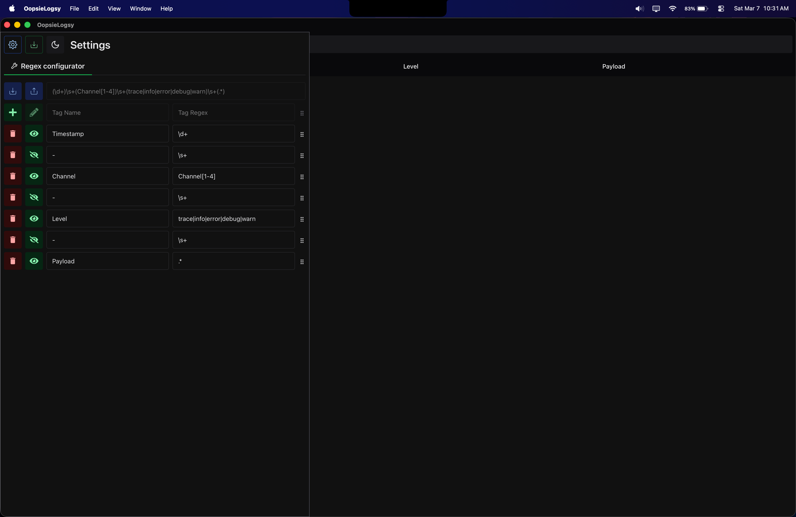
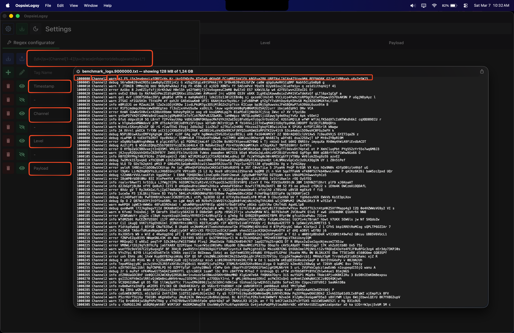
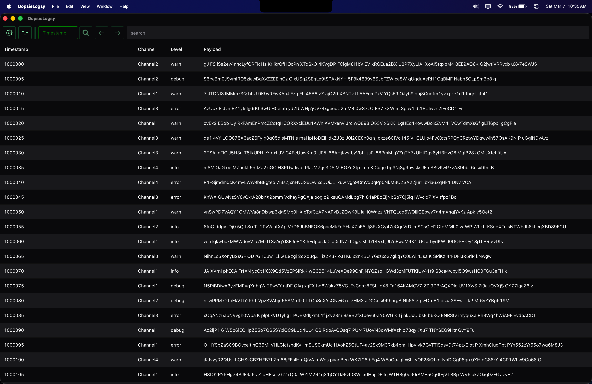
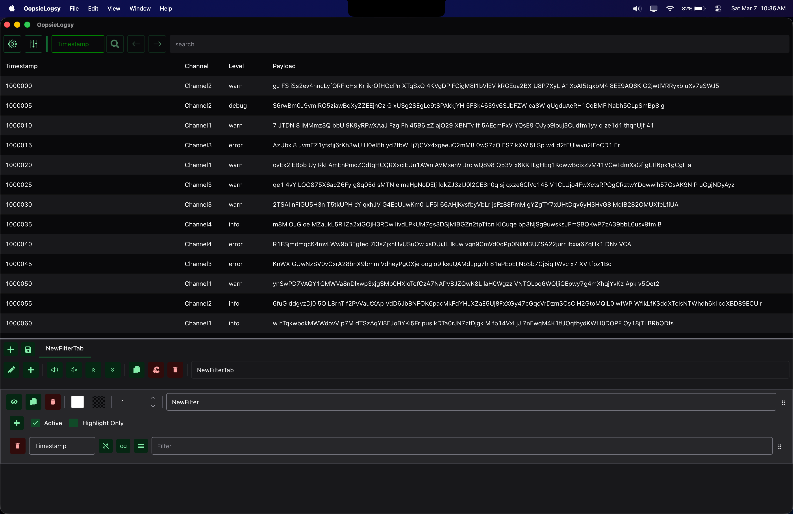
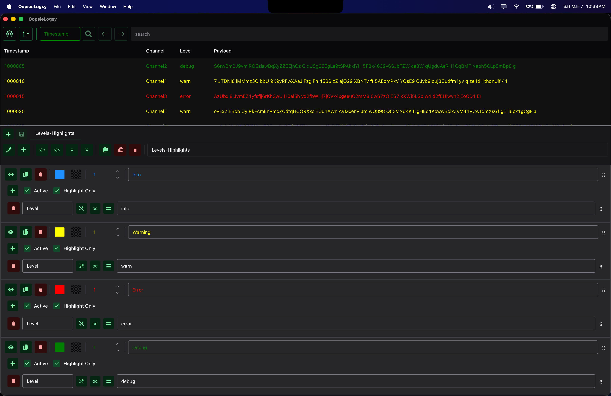
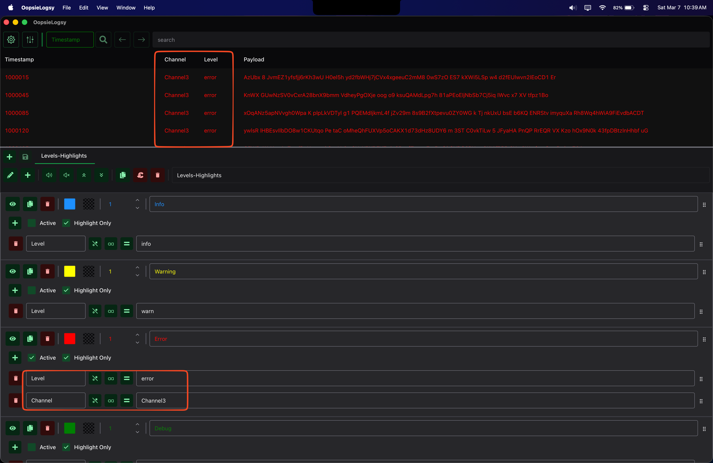
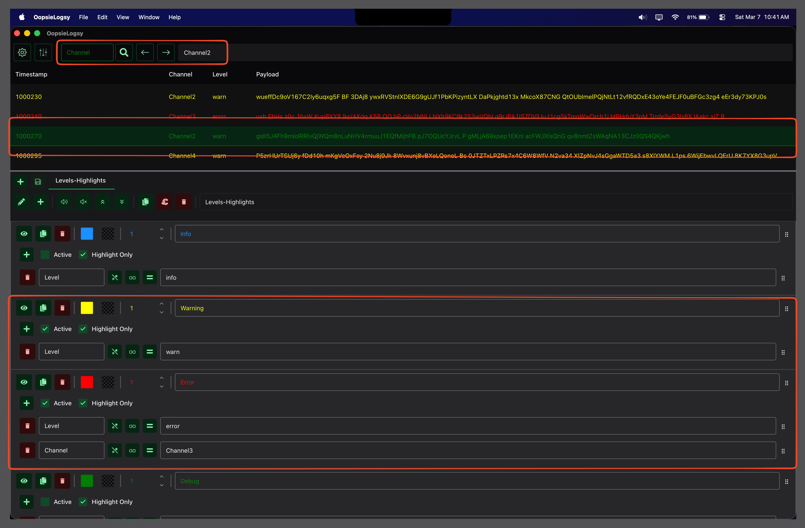

# ☕ 🪵 OopsieLogsy

**OopsieLogsy** is a simple, yet efficient log viewer designed to make large log files easier to explore and understand.

Built with **Tauri + React**, OopsieLogsy focuses on performance, clarity, and a clean developer-friendly workflow.

At the moment, OopsieLogsy is aimed primarily at **plain text log files**. Users provide a **regular expression** that splits each log line into columns, allowing the viewer to structure and display logs in a table-like format.

---

## 🎯 Goals

OopsieLogsy aims to be:

- lightweight
- fast with very large log files
- pleasant to use for developers

---

## ✨ Features

- Fast loading of large text log files
- Regex‑based parsing to split log lines into columns
- Smooth scrolling through very large logs
- Quick searching and filtering
- Clean and readable UI
- Cross‑platform desktop app (via Tauri)

---

## 🛠 Tech Stack

- **Rust** – backend via Tauri
- **React + TypeScript** – frontend
- **Vite** – build tooling
- **Redux Toolkit** – state management
- **Chakra UI** – UI components

---

## 🚀 Development

Install dependencies:

```
npm install
```

Run the Tauri app:

```
npm run tauri dev
```

---

## 📦 Build

Build the desktop application:

```
npm run tauri build
```

---

## 📄 License

MIT

## 🖼️ Gallery

Below are a few screenshots that showcase the main workflow of OopsieLogsy, from configuring a regex parser to exploring and filtering large log files.

### » Regex Configurator

Define the regular expression used to split each log line into structured columns.



### » Logs Import

Import large log files.



### » Logs View

View parsed logs in a structured table designed for smooth navigation through large datasets.



### » Default Log Filters

Quickly enable or disable common log filters to focus on relevant messages.



### » Highlight Log Levels

Color highlighting helps important log levels stand out during inspection. Here we can see each log level with a specific color.



### » Filter Logs

Apply custom filters to narrow down logs based on channels, levels, or message content.



### » Next/Prev Log

Navigate between matches when searching through logs to quickly jump to the next relevant entry.


