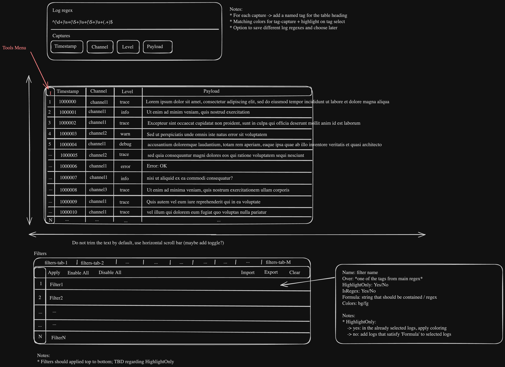

# » Capabilities Overview

This document represents iterations of schemas / features architecture.
Version tags are not related

## 1. » **v0.1.0** Capabilities

- Visualize logs
- Parse text log files with given regex:
  - for each regex capture, assign a nametag to be displayed as table column heading
- Log filters:
  - multiple filter tabs
  - apply filters
  - enable all filters
  - disable all filters
  - import filters
  - export filters
  - clear filters
- Filter configuration:
  - Name: filter name
  - Over: one of the tags from main regex
  - HighlightOnly: Yes/No
  - IsRegex: Yes/No
  - Formula: string that should be container / regex
  - Colors: bg/fg

### » v0.1.0 Schema

